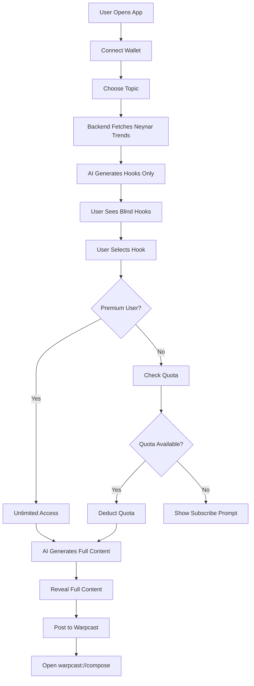

# HookLab AI

> A Farcaster-native mini app on Base that helps creators generate high-performing hooks using real social trend data, with blind hook selection and onchain subscription payment.

## 🎯 One-Liner

**HookLab AI**: Generate viral Farcaster hooks powered by real Base channel trends, with blind selection and onchain premium subscriptions.

---

## 🏗️ Architecture Overview

### Three-Layer Separation

```
┌─────────────────────────────────────────────────────────────┐
│                        FRONTEND                              │
│  Next.js + OnchainKit + Mobile-First UI                     │
│  • Wallet connection                                         │
│  • Topic selection                                           │
│  • Blind hook display                                        │
│  • Warpcast deep link                                        │
└─────────────────────────────────────────────────────────────┘
                            ↓
┌─────────────────────────────────────────────────────────────┐
│                    BACKEND (API Routes)                      │
│  Next.js API Routes - Single Source of Truth                │
│  • Quota enforcement                                         │
│  • Premium verification (reads contract)                     │
│  • Neynar data fetching                                      │
│  • AI orchestration (Eigen AI + Gemini)                      │
└─────────────────────────────────────────────────────────────┘
                            ↓
┌─────────────────────────────────────────────────────────────┐
│                   SMART CONTRACT (Base)                      │
│  Foundry - HookLabSubscription.sol                           │
│  • subscribeMonthly() - x402 payment                         │
│  • isPremium(address) - view function                        │
│  • Subscribed event emission                                 │
└─────────────────────────────────────────────────────────────┘
```

---

## 🚀 Core Features

### 1. Blind Hook Selection
- AI generates multiple hooks
- User sees **only hooks** (first sentence, ≤120 chars)
- No body content visible
- Selecting a hook **consumes quota**
- Full content revealed **only after selection**

### 2. Trend-Jacking
- Fetches high-engagement Farcaster posts from Base channel
- Calculates hook strength: `(likes + recasts + replies) / follower_count`
- AI uses structure and patterns (not copying)
- Crypto-native, timely output

### 3. Quota & Subscription
- **Free users**: Limited credits (default: 5)
- **Premium users**: Unlimited
- Premium status determined **onchain**
- Backend reads contract, enforces quota

---

## 📁 Project Structure

```
hackathon-hooklabai/
├── src/                          # Smart contracts (Foundry)
│   └── HookLabSubscription.sol
├── script/
│   └── Deploy.s.sol
├── test/
│   └── HookLabSubscription.t.sol
├── frontend/                     # Next.js application
│   ├── app/
│   │   ├── page.tsx
│   │   ├── layout.tsx
│   │   ├── api/                  # Backend API routes
│   │   │   ├── quota/
│   │   │   ├── hooks/generate/
│   │   │   ├── content/generate/
│   │   │   └── premium/verify/
│   │   └── components/
│   │       ├── WalletConnect.tsx
│   │       ├── TopicSelector.tsx
│   │       ├── HookSelector.tsx
│   │       ├── ContentReveal.tsx
│   │       └── SubscribeButton.tsx
│   └── lib/
│       ├── supabase.ts
│       ├── neynar.ts
│       ├── ai.ts
│       └── contract.ts
└── README.md
```

---

## 🛠️ Tech Stack

| Layer | Technology |
|-------|------------|
| **Smart Contract** | Foundry, Solidity ^0.8.13, Base |
| **Frontend** | Next.js (App Router), Coinbase OnchainKit, Wagmi, Viem |
| **Backend** | Next.js API Routes |
| **AI** | Eigen AI (orchestration), Gemini (LLM) |
| **Data** | Neynar API (Farcaster), Supabase (quota/users) |
| **Deployment** | Vercel (frontend), Base (contract) |

---

## ⚡ Quick Start (How to Run)

Follow these steps to get the project running in minutes.

### 0. Install Prerequisites (Node.js & Foundry)

First, ensure you have the correct version of Node.js installed. We recommend using `nvm`:

```bash
# 1. Install nvm (Node Version Manager)
curl -o- https://raw.githubusercontent.com/nvm-sh/nvm/v0.39.0/install.sh | bash
source ~/.bashrc

# 2. Install Node.js 18
nvm install 18
nvm use 18

# 3. Install Foundry (for Smart Contracts)
curl -L https://foundry.paradigm.xyz | bash
foundryup
```

### 1. Clone & Install Dependencies

```bash
git clone https://github.com/danielnoveno/hackathon-hooklabai.git
cd hackathon-hooklabai

# Install Frontend Dependencies
cd frontend
npm install
cd ..
```

### 2. Smart Contract Setup (Base Sepolia)

```bash
# Install dependencies
forge install

# Create .env file
cp .env.example .env

# Deploy to Testnet (requires private key with Sepolia ETH)
# Update .env with your PRIVATE_KEY first
forge script script/Deploy.s.sol --rpc-url https://sepolia.base.org --broadcast
```

*Copy the deployed contract address from the output!*

### 3. Database & Environment Setup

1. Create a project at [Supabase](https://supabase.com).
2. Run the SQL from `supabase-schema.sql` in the Supabase SQL Editor.
3. Configure the frontend:

```bash
cd frontend
cp .env.example .env.local
```

Edit `.env.local` and add your keys:
- `NEXT_PUBLIC_CONTRACT_ADDRESS`: (From Step 2)
- `NEXT_PUBLIC_SUPABASE_URL`: (From Supabase)
- `NEXT_PUBLIC_SUPABASE_ANON_KEY`: (From Supabase)

### 4. Run the Application

```bash
cd frontend
npm run dev
```

Open **http://localhost:3000** in your browser.

> 📘 **Detailed Guide**: For a complete deep-dive into every configuration option, see [SETUP.md](./SETUP.md).

---

## 🎮 Application Flow



---

## 🧪 Testing

### Smart Contract Tests
```bash
cd contracts
forge test -vvv
```

### Manual Testing Checklist
- [ ] Wallet connection works
- [ ] Topic selection displays
- [ ] Hooks are generated (no bodies visible)
- [ ] Hook selection deducts quota
- [ ] Premium users have unlimited quota
- [ ] Full content is revealed after selection
- [ ] Warpcast deep link opens correctly
- [ ] Subscription transaction works

---

## 🎯 Hackathon Success Criteria

This project succeeds if:

1. ✅ **Demoable in <60 seconds**
2. ✅ **Architecture is defensible** under Q&A
3. ✅ **Flow is understandable** to judges
4. ✅ **Aligns with Base ecosystem goals**:
   - Onchain value (subscription)
   - Social engagement (Farcaster)
   - Creator monetization (premium)

---

## 🚨 Important Notes

### What We CAN Claim
✅ Onchain subscription payment  
✅ Premium status verified onchain  
✅ Real Farcaster trend data integration  
✅ AI-powered hook generation  
✅ Blind hook selection mechanism  

### What We CANNOT Claim
❌ Quota stored onchain (it's in Supabase)  
❌ Tracking token purchases (we track subscriptions)  
❌ Production-ready scaling  
❌ Advanced AI reasoning (it's prompt-based)  

---

## 📚 Resources

- [Foundry Book](https://book.getfoundry.sh/)
- [Coinbase OnchainKit](https://onchainkit.xyz/)
- [Neynar API Docs](https://docs.neynar.com/)
- [Base Documentation](https://docs.base.org/)
- [Farcaster Frames](https://docs.farcaster.xyz/learn/what-is-farcaster/frames)

---

## 🤝 Contributing

This is a hackathon project. Focus on:
- Speed of implementation
- Architectural clarity
- Honest, defensible technical claims

Avoid:
- Production-grade scaling
- Complex indexers
- Overengineering

---

## 📄 License

MIT
