# HookLab AI

> **The Social Gateway to Base.** A Farcaster-native mini app designed to onboard the next generation of Indonesian creators to the Base ecosystem through data-driven virality and onchain rewards.

## 🎯 One-Liner
**HookLab AI**: Empowering creators to go viral on Base with AI-optimized hooks and a sustainable "Viral-to-Earn" economy.

---


## 🎯 Mission: Onboarding the Next Wave of Creators
Base is a land of opportunity, but for many creators in emerging markets like Indonesia, the barrier to entry remains high. HookLab AI acts as a **strategic gateway**, turning the complex world of Web3 into a simple, rewarding content game.

### ⚠️ The Problem
- **The Entry Barrier**: Creators are often intimidated by wallets and gas fees with no immediate incentive to join a new Layer 2.
- **The "Shadow" Effort**: Hours are wasted on content that fails because the "hook" isn't optimized for real-time social trends.
- **Value Gap**: Traditional platforms capture all the value, leaving creators without direct onchain rewards for their viral contributions.

### ✅ Our Solution: HookLab AI
- **Seamless Onboarding**: Creators join the Base ecosystem by connecting a wallet to unlock a powerful suite of AI tools.
- **Data-Backed Virality**: Leverages Neynar API to analyze /base channel trends, ensuring every hook is engineered for engagement.
- **Viral-to-Earn Mechanics**: Creates a rewarding ecosystem where high-performing content can earn recognition and rewards directly onchain.

---


## 🏗️ Architecture Overview

### Three-Layer Separation

```mermaid
graph TD
    subgraph Frontend [🌐 FRONTEND]
        direction TB
        A["<b>Mobile-First UI</b><br/>(Next.js + OnchainKit)"] --> B[Smart Wallet Connection]
        B --> C[Farcaster Topic Selection]
        C --> D[Blind Hook Selection]
        D --> E[Warpcast Deep Link]
    end

    subgraph Backend [⚙️ BACKEND]
        direction TB
        F["<b>Backend Services</b><br/>(Next.js API Routes)"] --> G[(Supabase: User Quota)]
        H[Premium Verification] --> I[Read Smart Contract State]
        J[Neynar API: Farcaster Trends] --> K[AI Orchestration: Eigen + Gemini]
    end

    subgraph Blockchain [⛓️ BLOCKCHAIN]
        direction TB
        L["<b>Base L2</b><br/>HookLabSubscription.sol"]
        L --> L1["subscribeMonthly() - x402 Payment"]
        L --> L2["isPremium() - View Function"]
        L --> L3["Subscribed Event Emission"]
    end

    Frontend <==> Backend
    Backend <==> Blockchain
```




---


## 🚀 Core Features

### 1. Blind Hook Selection
- AI generates multiple high-potential hooks based on social data.
- User sees **only hooks** (first sentence, ≤120 chars) to maintain focus.
- No body content visible until the selection is finalized.
- Selecting a specific hook **consumes 1 quota credit**.
- Full content detail is revealed **only after selection** is confirmed.

### 2. Trend-Jacking
- Fetches high-engagement Farcaster posts directly from the Base channel.
- Calculates hook strength using the formula: `(likes + recasts + replies) / follower_count`.
- AI leverages successful structures and patterns without copying content.
- Delivers crypto-native and timely output tailored for the ecosystem.

### 3. Quota & Subscription
- **Free users**: Receive limited credits for exploration (default: 5).
- **Premium users**: Enjoy unlimited hook reveals and content generation.
- Premium status is determined and verified **onchain** via Base.
- Backend reads the smart contract state to enforce quota rules accurately.

---


## 📁 Project Structure

```
hackathon-hooklabai/
├── src/                          # Smart contracts (Foundry)
│   └── HookLabSubscription.sol
├── script/
│   └── Deploy.s.sol
├── test/
│   └── HookLabSubscription.t.sol
├── frontend/                     # Next.js application
│   ├── app/
│   │   ├── page.tsx
│   │   ├── layout.tsx
│   │   ├── api/                  # Backend API routes
│   │   │   ├── quota/
│   │   │   ├── hooks/generate/
│   │   │   ├── content/generate/
│   │   │   └── premium/verify/
│   │   └── components/
│   │       ├── WalletConnect.tsx
│   │       ├── TopicSelector.tsx
│   │       ├── HookSelector.tsx
│   │       ├── ContentReveal.tsx
│   │       └── SubscribeButton.tsx
│   └── lib/
│       ├── supabase.ts
│       ├── neynar.ts
│       ├── ai.ts
│       └── contract.ts
└── README.md
```

---


## 🛠️ Tech Stack

| Layer | Technology | Role |
|-------|------------|------|
| **Blockchain** | **Base L2** | Scalable, low-fee infrastructure for creator economy |
| **Smart Contract** | Foundry / Solidity | Secure subscription & status verification |
| **Frontend** | Next.js (App Router) | Mobile-first, high-performance creator UI |
| **Onchain Tools** | **Coinbase OnchainKit** | Seamless Smart Wallet & Paymaster integration |
| **Backend** | Next.js API Routes | The central orchestrator for data & AI |
| **Social Data** | **Neynar API** | Real-time indexing of Farcaster/Base trends |
| **AI Engine** | Eigen AI + Gemini | Advanced LLM for viral content generation |
| **Database** | Supabase | Efficient off-chain quota & user management |

---


## ⚡ Quick Start (How to Run)

Follow these steps to get the project running in minutes.

### 0. Install Prerequisites (Node.js & Foundry)

First, ensure you have the correct version of Node.js installed. We recommend using `nvm`:

```bash
# 1. Install nvm (Node Version Manager)
curl -o- https://raw.githubusercontent.com/nvm-sh/nvm/v0.39.0/install.sh | bash
source ~/.bashrc

# 2. Install Node.js 18
nvm install 18
nvm use 18

# 3. Install Foundry (for Smart Contracts)
curl -L https://foundry.paradigm.xyz | bash
foundryup
```

### 1. Clone & Install Dependencies

```bash
git clone https://github.com/danielnoveno/hackathon-hooklabai.git
cd hackathon-hooklabai

# Install Frontend Dependencies
cd frontend
npm install
cd ..
```

### 2. Smart Contract Setup (Base Sepolia)

```bash
# Install dependencies
forge install

# Create .env file
cp .env.example .env

# Deploy to Testnet (requires private key with Sepolia ETH)
# Update .env with your PRIVATE_KEY first
forge script script/Deploy.s.sol --rpc-url https://sepolia.base.org --broadcast
```

*Copy the deployed contract address from the output!*

### 3. Database & Environment Setup

1. Create a project at [Supabase](https://supabase.com).
2. Run the SQL from `supabase-schema.sql` in the Supabase SQL Editor.
3. Configure the frontend:

```bash
cd frontend
cp .env.example .env.local
```

Edit `.env.local` and add your keys:
- `NEXT_PUBLIC_CONTRACT_ADDRESS`: (From Step 2)
- `NEXT_PUBLIC_SUPABASE_URL`: (From Supabase)
- `NEXT_PUBLIC_SUPABASE_ANON_KEY`: (From Supabase)

### 4. Run the Application

```bash
cd frontend
npm run dev
```

Open **http://localhost:3000** in your browser.

> 📘 **Detailed Guide**: For a complete deep-dive into every configuration option, see [SETUP.md](./SETUP.md).

---


## 🎮 Application Flow

We prioritize a frictionless user journey, moving creators from a cold start to a viral post in less than 60 seconds.


---


## 🧪 Testing

### Smart Contract Tests
```bash
# Ensure you are in the root directory
forge test -vvv
```

### Manual Testing Checklist
- [ ] Wallet connection via OnchainKit works seamlessly
- [ ] Topic selection correctly displays real-time Farcaster trends
- [ ] AI generates hooks only (no bodies visible) during selection
- [ ] Selecting a hook correctly deducts 1 quota from Supabase
- [ ] Premium users have unlimited quota verified onchain
- [ ] Full content is revealed only after selection is made
- [ ] Warpcast deep link opens the compose action correctly
- [ ] Subscription transaction on Base updates user status

---


## 🎯 Hackathon Success Criteria

This project is designed to meet the highest standards of the Base ecosystem:

1. ✅ **Demoable in <60 seconds**: The user journey from wallet connection to generating a viral post is engineered for maximum speed and retention.
2. ✅ **Defensible Architecture**: Our hybrid Onchain-Offchain model is built to stand up to technical scrutiny during judge Q&A sessions.
3. ✅ **Understandable Flow**: Both judges and creators can grasp the core value proposition of HookLab AI instantly upon first use.
4. ✅ **Alignment with Base Ecosystem Goals**:
   - **Onchain Value**: Real-world subscription revenue processed directly on the Base network.
   - **Social Engagement**: Deep, native integration with the Farcaster protocol via Neynar indexing.
   - **Creator Monetization**: Opening new, sustainable income paths for creators on top of the blockchain.

---


## 🚨 Important Notes

### What We CAN Claim
- ✅ Onchain subscription payment handling
- ✅ Premium status verified directly on the Base blockchain
- ✅ Real-time Farcaster trend data integration via Neynar API
- ✅ AI-powered viral hook generation using Gemini & Eigen AI
- ✅ Psychological blind hook selection mechanism

### What We CANNOT Claim 
- ❌ Quota stored onchain (Managed in Supabase for a gas-less experience)
- ❌ Tracking individual token purchases (Focus is on monthly subscriptions)
- ❌ Production-ready scaling
- ❌ Advanced AI reasoning (The logic is strictly prompt-based)

---

## 📚 Resources

- [Foundry Book](https://book.getfoundry.sh/)
- [Coinbase OnchainKit](https://onchainkit.xyz/)
- [Neynar API Docs](https://docs.neynar.com/)
- [Base Documentation](https://docs.base.org/)
- [Farcaster Frames](https://docs.farcaster.xyz/learn/what-is-farcaster/frames)

---

## 🤝 Contributing

This is a hackathon project. Focus on:
- Speed of implementation
- Architectural clarity
- Honest, defensible technical claims

Avoid:
- Production-grade scaling
- Complex indexers
- Overengineering

---

## 📄 License

MIT
